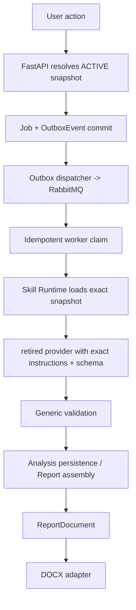

# 0009 — Authoritative Skill Runtime and Execution Hardening

- Status: implemented
- Date: 2026-09-13

## Decision

`SkillSnapshot` is the immutable execution contract. API job creation resolves
the currently active snapshot and stores its ID on `Job`, `AnalysisRun`,
`Report`, and `ReportSnapshot` where applicable. The RabbitMQ envelope carries
the ID plus the content hash. The bridge retrieves the row by ID, verifies its
captured bytes against the hash, and materializes only those three files into
the per-job sandbox mount. It never uses the current checkout for a snapshot
backed job.

The application keeps name/version/hash fields as compatibility and display
metadata; they are not execution selectors. Activation validates instructions,
manifest, JSON Schema, and declared dependencies before atomically selecting a
single active snapshot. Existing jobs are unaffected by later activation or
rollback.

`apps/api/app/skills/runtime.py` is the backend contract module for loading and
validating snapshots. Dependencies may be named or pinned as `{id, version}`;
activation resolves every dependency against an existing snapshot. The bridge
materializer is separate because the bridge is separately deployable. Both are
deliberately behind narrow interfaces rather than leaking storage details to
orchestration.

The output schema is skill-owned: the exact snapshot's `output.schema.json` is
mounted into `/skills/<skill>/` and drives retired provider `--json-schema`, followed by
generic JSON Schema validation. Skill-specific result fields remain in the
skill-owned report assembly layer, never in generic validation or sandbox
schema constants.

Reports pass through `ReportDocument`, a semantic block IR. Assemblers decide
section meaning and order; the DOCX adapter handles only document mechanics.
The adapter accepts generic headings, paragraphs, bilingual text, metadata,
links, evidence, screenshots, log references, analysis references, dividers,
and page breaks, so a changed skill result needs a new assembler/fixture, not a
renderer rewrite. `renderer_profile: report-document-v1` supports a declarative
`metadata.title` plus semantic `blocks` result through the same adapter.

## Operational hardening

Outbox dispatch claims one row per transaction and `OUTBOX_MODE` selects
embedded versus external dispatch topology. Job leases are configured timeout
plus a safety margin and are renewed by a separate heartbeat connection while
work is running. OAuth/output mounts use restricted permissions, and CI uses a
pinned MinIO release.

The canonical job envelope remains `packages/contracts/job_message.schema.json`.
The snapshot ID is optional only for legacy producers during migration; all
API-created jobs include it. Removing that compatibility branch is a future
breaking protocol migration.

