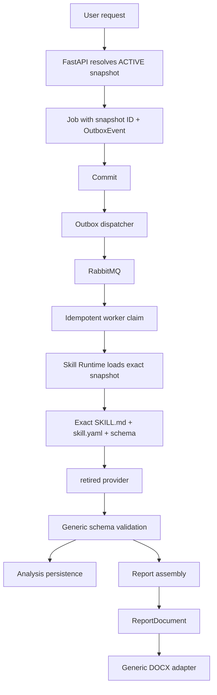

# 0010 — Phase 5 Runtime Correctness and Flexible Reporting

- Status: implemented
- Date: 2026-09-13
- Supersedes: the hash-only execution wording in ADR 0007

## Context

Skill metadata existed before this phase, but queued work could still be
coupled to a mutable checkout and generic runtime code contained assumptions
about one analysis/report shape. The system also needed explicit ownership for
outbox rows and a lease policy safe for long-running retired provider jobs.

## Decisions

### Authoritative SkillSnapshot runtime

API job creation resolves the one active snapshot for the logical skill and
stores its immutable ID on the Job. AnalysisRun, Report, and ReportSnapshot
retain the same provenance where applicable. The bridge loads the snapshot by
ID, verifies its captured content hash, resolves pinned dependencies, and
materializes only the exact prompt, manifest, and output schema for that job.
Activation validates the contract before atomically moving the active pointer;
rollback is simply activation of an older snapshot. Existing jobs never change.

### Skill-owned contracts

The snapshot's `output.schema.json` is passed to retired provider and used by generic
JSON Schema validation. Result field names are not part of bridge or sandbox
infrastructure. Execution policy and input materialization details are
declared in `skill.yaml`; legacy manifests remain readable during migration.

### ReportDocument

Report skills either use the existing compatibility assembler or emit a
declarative `metadata` plus `blocks` result. Assembly owns semantic order and
meaning. The DOCX adapter consumes only `ReportDocument` primitives: headings,
paragraphs, bilingual text, metadata, links, evidence, screenshots, log
references, analysis references, dividers, and page breaks. It owns Word
formatting and no report field names.

### Outbox and leases

The dispatcher claims one row, publishes it, marks it published, and commits
that row in one transaction. This avoids releasing locks on an unpublished
batch. RabbitMQ remains at-least-once and consumers remain idempotent.
`OUTBOX_MODE=embedded` runs the API-local dispatcher; `external` leaves it to
`python -m app.outbox_worker` so production deployments do not accidentally
run both topologies. A worker lease is the configured job timeout plus a
safety margin and is renewed by a separate heartbeat connection during work.

### Canonical protocol

`packages/contracts/job_message.schema.json` is the language-neutral wire
contract. Producer and bridge validate the same schema. Protocol additions are
backward-compatible while legacy producers are being retired; all API-created
jobs include the snapshot ID and execution policy envelope.

## Final flow

## Consequences

Changing skill instructions, manifest behavior, dependencies, or output
schema creates a new content identity and naturally invalidates the analysis
cache. Historical analysis/report provenance remains queryable through
snapshot IDs, hashes, evidence hashes, model, effort, and policy telemetry.
The active daily-report source now publishes a declarative `ReportPlan`
under the `report-document-v1` renderer profile; deterministic composition
resolves that plan into `ReportDocument`. Historical snapshots that still declare the
legacy `daily_report_docx` profile remain executable through the compatibility
adapter, so migration does not change existing reports.
